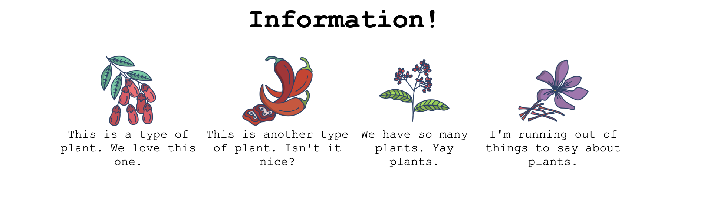

# A very common website feature
The goal of this exercise is to recreate a section that is found on many informational websites.

For this one you will need to edit the HTML a little bit too. We can't be making things too easy for you. You'll want to add containers around the various elements so that you can flex them. Good luck!

## My output
